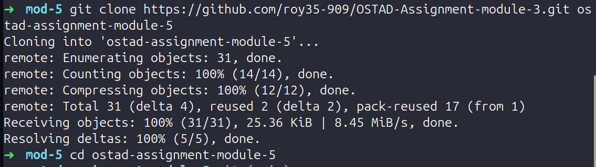

# CI/CD Pipeline with GitHub Actions & Self-Hosted Runner

---

## Step 1: Repository Setup

### 1.1 Clone the Provided Repository

Clone the original repository to your local machine:

```bash
git clone https://github.com/roy35-909/OSTAD-Assignment-module-3
cd OSTAD-Assignment-module-3
```



### 1.2 Add New Remote Origin

Create a new repository on your GitHub account, then add it as the remote origin:

```bash
git remote add origin https://github.com/<your-username>/<your-repo-name>.git
```


### 1.3 Push Code to New Repository

```bash
git push -u rezuan main
```


---

## Step 2: EC2 Instance & Server Setup

### 2.1 Create an EC2 Instance

Launch an Ubuntu EC2 instance on AWS


---

## Step 3: SSH Key Configuration

### 3.1 Generate SSH Key on EC2


### 3.2 Add Public Key to Authorized Keys

Add the public key to the authorized keys file so GitHub Actions can SSH in:


---

## Step 4: GitHub Repository Secrets

Three secrets are required for the pipeline to SSH into the deployment server.

### 4.1 Add Secrets to GitHub Repository

Copy the private key content:

Go to your GitHub repository → **Settings** → **Secrets and variables** → **Actions** → **New repository secret**, and add:

| Secret Name   | Value                                     |
| ------------- | ----------------------------------------- |
| `EC2_SSH_KEY` | Contents of `~/.ssh/id_rsa` (private key) |
| `EC2_HOST`    | Your EC2 public IP address                |
| `EC2_USER`    | `ubuntu` (or your EC2 username)           |


---

## Step 5: Self-Hosted Runner Setup

### 5.1 Configure the Self-Hosted Runner on EC2

Go to your GitHub repository → **Settings** → **Actions** → **Runners** → **New self-hosted runner**.

Select **Linux** and follow the instructions to download and configure the runner on your EC2:

To run as a background service:

```bash
sudo ./svc.sh install
sudo ./svc.sh start
```


---

## Step 6: GitHub Actions Workflow

Create the workflow file at `.github/workflows/cicd.yml`:


### Full Workflow File

```yaml
name: CI/CD Pipeline

on:
  push:
    branches:
      - main

jobs:
  test:
    name: Test Job
    runs-on: self-hosted

    steps:
      - name: Checkout Code
        uses: actions/checkout@v4

      - name: Setup Node.js v22
        uses: actions/setup-node@v4
        with:
          node-version: '22'

      - name: Install Dependencies
        run: npm install

      - name: Run Tests & Capture Results
        run: npm run check 2>&1 | tee test-results.txt

      - name: Upload Test Results Artifact
        uses: actions/upload-artifact@v4
        with:
          name: test-results
          path: test-results.txt

  deploy:
    name: Deploy Job
    runs-on: self-hosted
    needs: test

    steps:
      - name: Download Test Results Artifact
        uses: actions/download-artifact@v4
        with:
          name: test-results

      - name: Display Test Results
        run: cat test-results.txt

      - name: Setup SSH Key
        run: |
          mkdir -p ~/.ssh
          echo "${{ secrets.EC2_SSH_KEY }}" > ~/.ssh/deploy_key
          chmod 600 ~/.ssh/deploy_key
          ssh-keyscan -H ${{ secrets.EC2_HOST }} >> ~/.ssh/known_hosts

      - name: SSH into Deployment Server & Deploy
        run: |
          ssh -i ~/.ssh/deploy_key ${{ secrets.EC2_USER }}@${{ secrets.EC2_HOST }} << 'ENDSSH'

            if ! node -v 2>/dev/null | grep -q "v22"; then
              curl -fsSL https://deb.nodesource.com/setup_22.x | sudo -E bash -
              sudo apt install -y nodejs
            fi
            echo "Node version: $(node -v)"

            if ! command -v pm2 &> /dev/null; then
              sudo npm install -g pm2
            fi
            echo "PM2 version: $(pm2 -v)"

            if ! command -v nginx &> /dev/null; then
              sudo apt install -y nginx
              sudo systemctl enable nginx
              sudo systemctl start nginx
            fi
            echo "Nginx version: $(nginx -v 2>&1)"

            APP_DIR=~/app/node-express-app

            if [ -d "$APP_DIR/.git" ]; then
              echo "Repo exists, pulling latest..."
              cd $APP_DIR
              git pull origin main
            else
              echo "Cloning repo..."
              mkdir -p ~/app
              git clone https://github.com/${{ github.repository }} $APP_DIR
            fi

            cd $APP_DIR
            npm install --production

            sudo bash -c 'printf "server {\n    listen 80;\n    server_name _;\n\n    location / {\n        proxy_pass http://localhost:3000;\n        proxy_http_version 1.1;\n        proxy_set_header Upgrade \$http_upgrade;\n        proxy_set_header Connection \"upgrade\";\n        proxy_set_header Host \$host;\n        proxy_cache_bypass \$http_upgrade;\n    }\n}\n" > /etc/nginx/sites-available/default'

            sudo rm -f /etc/nginx/sites-enabled/default
            sudo ln -sf /etc/nginx/sites-available/default /etc/nginx/sites-enabled/default
            sudo nginx -t && sudo systemctl reload nginx
            echo "Nginx reloaded successfully"

            pm2 stop node-express-app || true
            pm2 delete node-express-app || true
            pm2 start $APP_DIR/src/server.js --name node-express-app
            pm2 save
            pm2 status

          ENDSSH

      - name: Cleanup SSH Key
        if: always()
        run: rm -f ~/.ssh/deploy_key
```

### What Each Job Does

**Test Job:**

- Checks out the code onto the self-hosted runner
- Sets up Node.js v22
- Installs dependencies with `npm install`
- Runs Mocha tests via `npm run check` and captures output to `test-results.txt`
- Uploads `test-results.txt` as a GitHub Actions artifact

**Deploy Job** (runs only after test job succeeds):

- Downloads the test results artifact
- Displays the test results in the pipeline logs
- Sets up the SSH key from repository secrets
- SSHes into the deployment server and:
  - Installs Node.js v22, PM2, and Nginx if not already present
  - Clones the repository (or pulls latest if already cloned)
  - Installs production dependencies
  - Configures Nginx as a reverse proxy to port 3000
  - Deploys the app using PM2
- Cleans up the SSH key after deployment (even on failure)

---

## Step 7: Pipeline Execution & Results

### 7.1 Successful Pipeline Run

After pushing to `main`, the pipeline triggers automatically. The test job completes first, followed by the deploy job.


### 7.2 Application Running on EC2 Public IP

The Node.js application is accessible via the EC2 public IP through Nginx on port 80:


---

## Challenges & Solutions

### Challenge 1: `docker: command not found` on Self-Hosted Runner

**Problem:** The `appleboy/ssh-action` GitHub Action uses a Docker container internally. Since the self-hosted runner (EC2) did not have Docker installed, the action failed immediately with `docker: command not found`.

**Solution:** Replaced `appleboy/ssh-action` entirely with native bash SSH commands. The deploy job now writes the private key to `~/.ssh/deploy_key`, uses `ssh-keyscan` to add the host to known hosts, and connects using the standard `ssh` CLI — no Docker required.

---

### Challenge 2: Nginx Showing Default Page Instead of the App

**Problem:** After deployment, visiting the EC2 public IP showed the default Nginx welcome page instead of the Node.js application.

**Solution:** The issue was caused by a heredoc inside a nested `sudo bash -c` block — the `EOF` closing delimiter was being written into the config file as literal text, causing an Nginx config parse error (`unexpected end of file, expecting ";" or "}"`). Switched to `printf` with escaped characters written via `sudo bash -c`, which reliably writes the config without any delimiter leakage. Also explicitly removed the default symlink from `sites-enabled` and created a fresh one pointing to the updated config.
